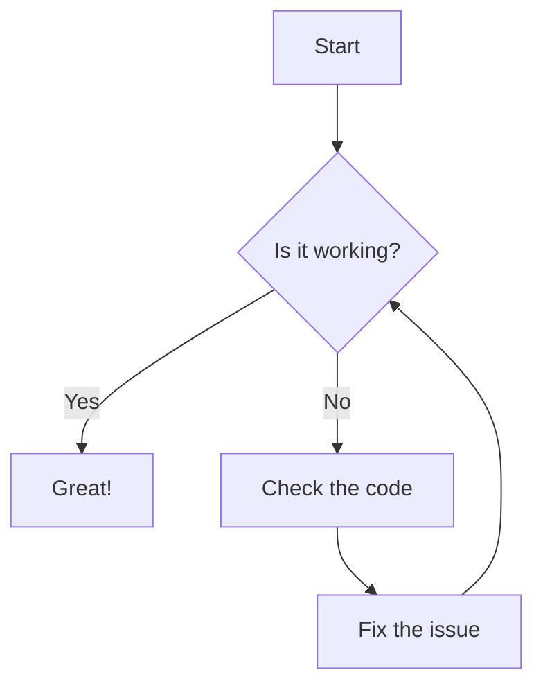

# First Slide - Title

- This is the first slide.

| Column 1 | Column 2 |
| -------- | -------- |
| Data 1   | Data 2   |

---

# Second Slide - List

- This is the second slide.
- It contains a list.
- You can add as many items as you like.
- Remember to keep it concise!
- You can also use sub-lists:
  - Sub-item 1
  - Sub-item 2
  - Sub-item 3

---

# Third Slide - changes

- this is me making changes to the file to see how it works with git and marp

